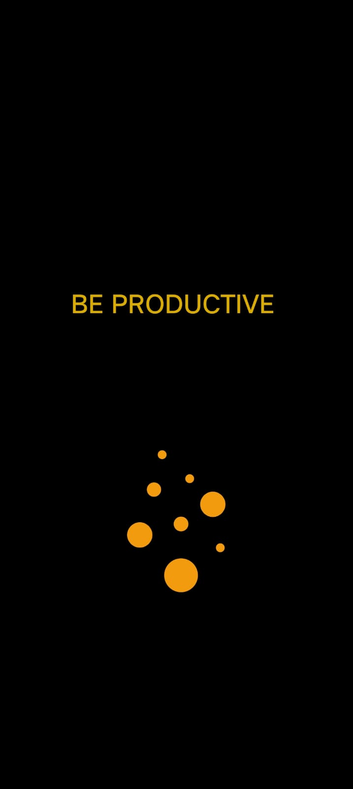

# Be Productivity App
 
Features 
1- <b>Productive Space<b> 
  i  - Create Notes  
  ii - Create Todos  
2- Work Space  
  i   - Create Workspaces to collab with people    
  ii  - Create channels in it and interact on various topics [Implementation of Real-Time Chatting is Under Development ]   
  iii - Quick Note & Todo Access SO YOU DONT MISS OUT anything while discussing about something important [Implementation of Quick Notes is Under Development ]  
 
Tech Stack  
  - React Native (Frontend)
  - State Management (Redux)
  - Node js (Backend)
  - Database (Mongo)
 
Screenshots  
 

  
  
  

<h3><a href="">For Collaborating in this Project </a></h3>
